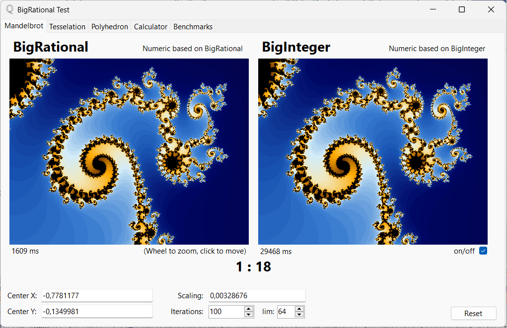
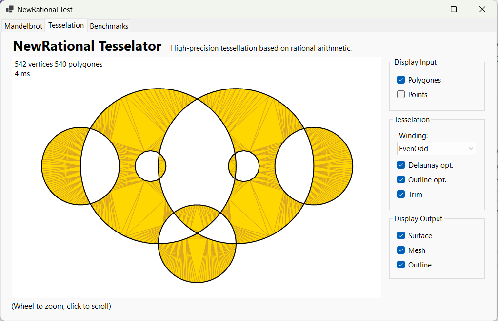
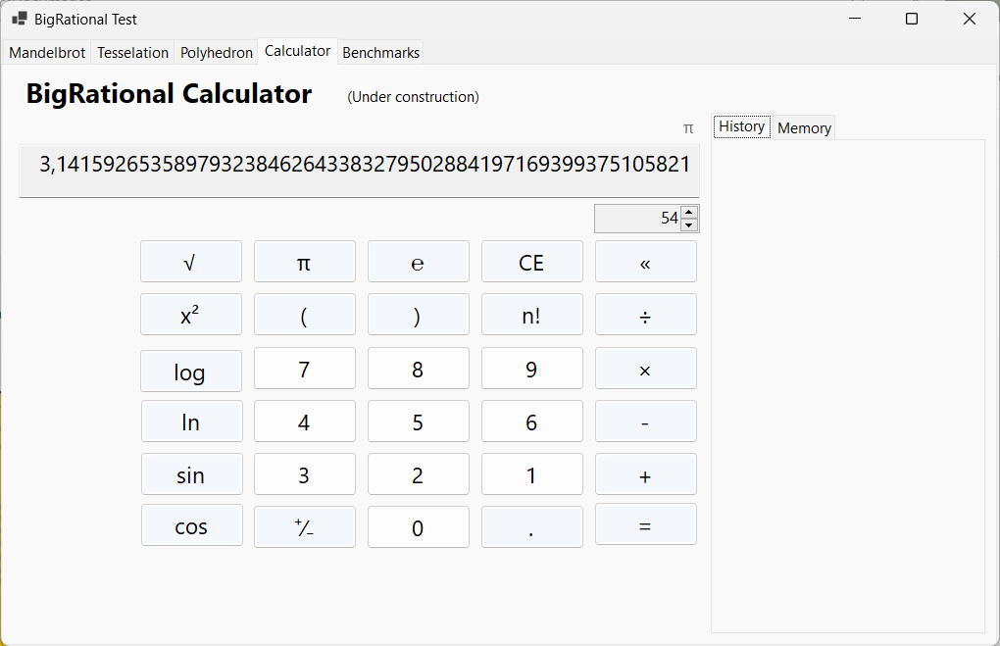

# BigRational - a novel rational number class.

BigRational is a rational number class for arbitrary-precision arithmetic.  
There are no practical limits to the precision except the ones implied by the available memory.  
In difference to the usual implementations of such a class, the new system offers 
a significantly better performance and better memory usage.  
This is mainly due to the advantages of a stack machine, which minimizes the need for memory allocations and copies, 
and which allows to apply more efficient numerical algorithms.  
The way it works and the [Api Documentation](https://c-ohle.github.io/RationalNumerics/api/System.Numerics.Rational.html)
is available on [github-pages](https://c-ohle.github.io/RationalNumerics/).

As ultimate speed test compared to an ordinary BigRational class based on BigInteger, here the Mandelbrot set.   
This example contains everything, all basic numeric operations, small and big numbers, numbers with few and with many digits, iterations, threading and is generally very computationally intensive.  
It shows that the new system is many times faster than what is even possible with conventional technique.  
Theoretically, the increase in performance should be around factor of 10, which is confirmed by the test.  
By zooming deeper into the Mandelbrot set, a factor of 20 and more is possible due to the massive memory garbage the old system implies.

 
The second example is an ultimate test for the stacking machine.  
The Tesselator uses its own instance of a BigRational.CPU stack machine, which is also used as a vertex buffer. Almost all CPU instructions are in use.  
In this form no further memory allocations are necessary at runtime and the tessellation can never fail what is a big problem for any floating-point tessellation algorithm. 

The third example, a calculator, is intended for testing BigRational's high-level functions API.  
No problem to calculate with thousands of decimal digits.  
Precisission, string formattings and speed for the several functions can be checked.

More detailed benchmarks coming soon.   

For questions or suggestions: [c.ohle@outlook.com](mailto:c.ohle@outlook.com).

<!--
The precision is useful for solving robustness problems of algorithms that are sensitive to it.  
Geometric algorithms in particular tend to do this. E.g. With rational arithmetic, the intersections of lines, planes as well as transformations are always exact 
and corresponding algorithms cannot fail, as is always possible with floating-point arithmetic.
-->