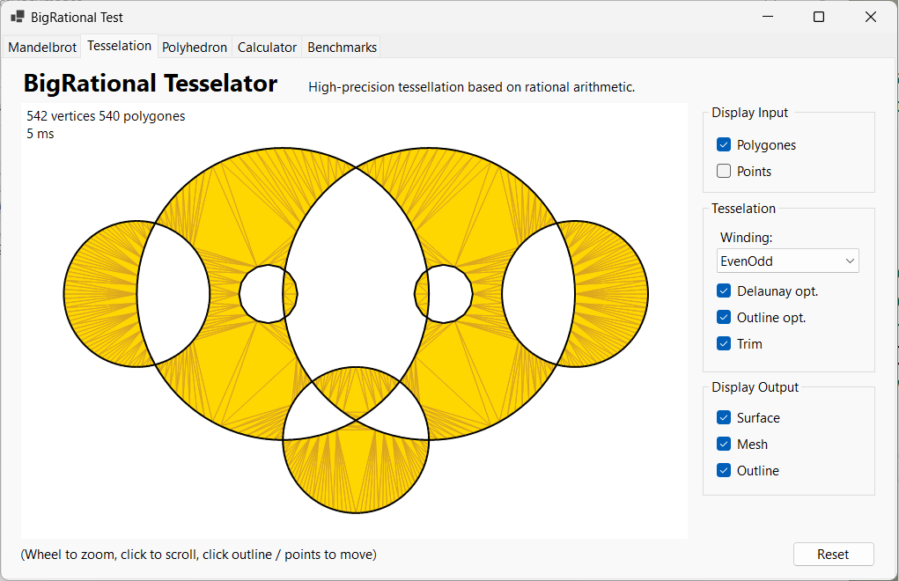
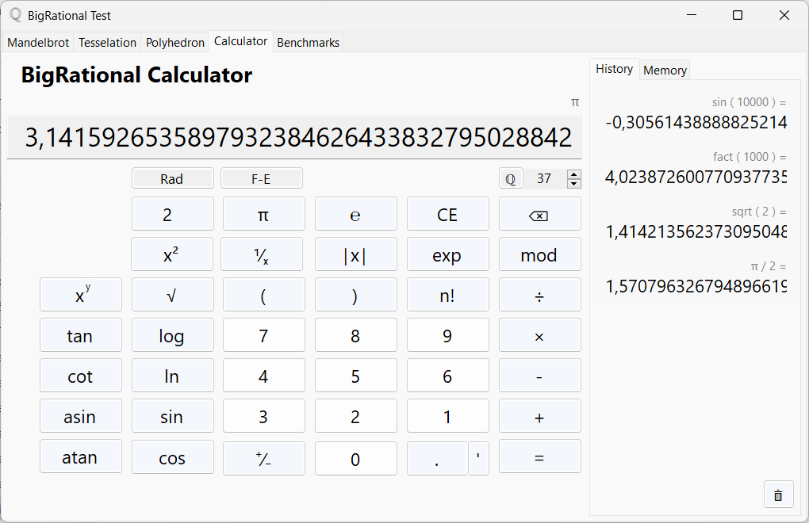
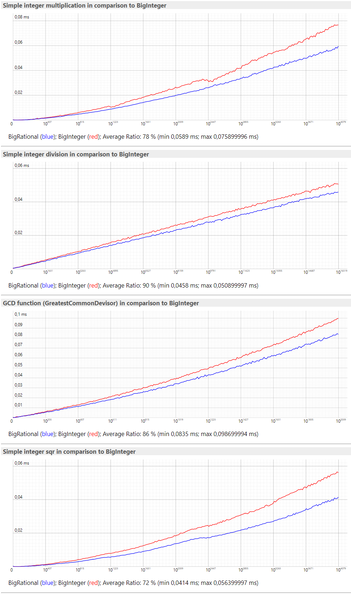

# BigRational - a novel rational number class.

> A new implementation is under development:   
[BigRat.cs](https://github.com/c-ohle/RationalNumerics/blob/master/Test/math/BigRat.cs)
(as single file solution, just copy and try)  
New basics, smaller, more performance on operator level,
[description in short](https://c-ohle.github.io/RationalNumerics/bigrat/bigrat.html).  
Maybe already the better choice.

BigRational is a rational number class for arbitrary-precision arithmetic.  
There are no practical limits to the precision except the ones implied by the available memory.  
In difference to the usual implementations of such a class, the new system offers 
a significantly better performance and better memory usage.  
This is mainly due to the advantages of a stack machine, which minimizes the need for memory allocations and copies, 
and which allows to apply more efficient numerical algorithms.
The way it works and the [Api Documentation](https://c-ohle.github.io/RationalNumerics/api/System.Numerics.html)
is available on [GitHub-Pages](https://c-ohle.github.io/RationalNumerics/).

As ultimate speed test compared to an ordinary BigRational class based on BigInteger, here the Mandelbrot set.   
This example contains everything, all basic numeric operations, small and big numbers, numbers with few and with many digits, iterations, threading and is generally very computationally intensive.  
It shows that the new system is many times faster than what is even possible with conventional technique.  
Theoretically, the increase in performance should be around factor of 10, which is confirmed by the test.  
By zooming deeper into the Mandelbrot set, a factor of 20 and more is possible due to the massive memory garbage the old system implies.

 
The second example is an ultimate test for the stacking machine.  
The Tesselator uses its own instance of a BigRational.CPU stack machine, which is also used as a vertex buffer. Almost all CPU instructions are in use.  
In this form no further memory allocations are necessary at runtime and the tessellation can never fail what is a big problem for any floating-point tessellation algorithm. 

The third example is an intensive test for a set of 3D vector types and algorithms
based on BigRational and BigRational.CPU arithmetic.  
All 3D mesh calculations, polygon tessellations, CSG, etc. are done in real time at animation time.

The fourth example, a calculator, is intended for testing BigRational's high-level functions API.  
No problem to calculate with thousands of decimal digits.  
Precisission, string formattings and speed for the several functions can be checked.

The Benchmarks are currently under construction.  
The bottle-nack for rational arbitrary arithmetic is the integer multiplication and for the normalization the GCD function and the integer division.   
The first benchmarks showing that the BigRational calculation core is aprximatly 15% faster then the equivalent functions in System.Numerics.BigInteger.  
With other words, using BigRagtional for pure integer arithmetics can improve the performance, and together by using the CPU dramatic.

BigInteger in NET 7 will use Spans more stack allocs and shared buffers.  
The benchmarks made with NET 7 preview versions are showing that this reduces a little bit the memory pressure  
but further degreads the performance especialliy for big numbers.

More detailed benchmarks coming soon. 

* How it works and how to use it: [https://c-ohle.github.io/RationalNumerics](https://c-ohle.github.io/RationalNumerics)
* Api Documentation: [https://c-ohle.github.io/RationalNumerics/api/System.Numerics.html](https://c-ohle.github.io/RationalNumerics/api/System.Numerics.html)
* NuGet Package: [https://www.nuget.org/packages/BigRational](https://www.nuget.org/packages/BigRational)
* State and discussion [.NET7 version](https://github.com/dotnet/runtime/issues/71791)